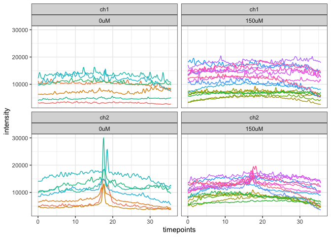
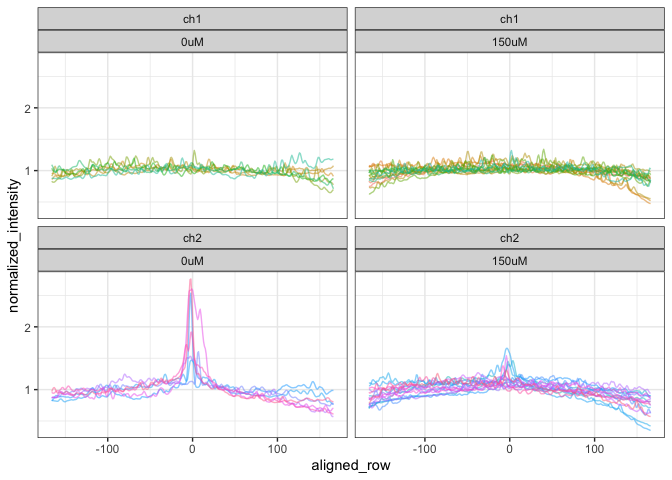
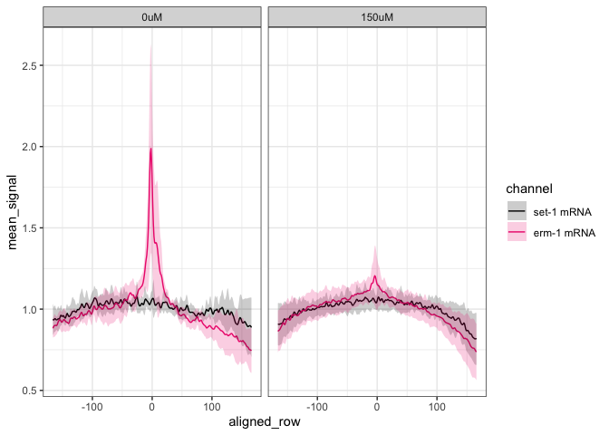
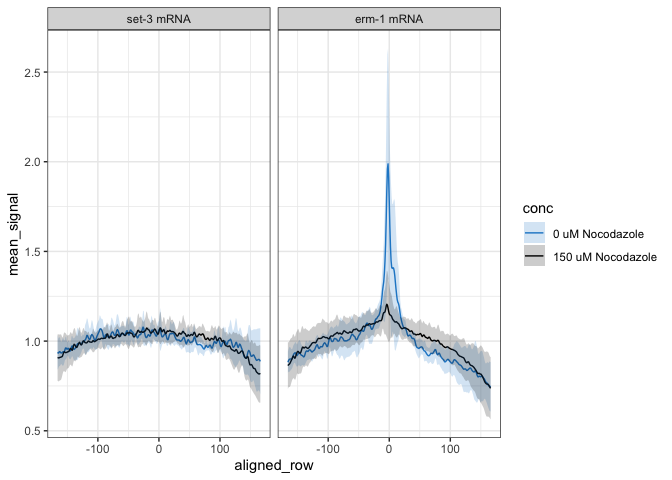
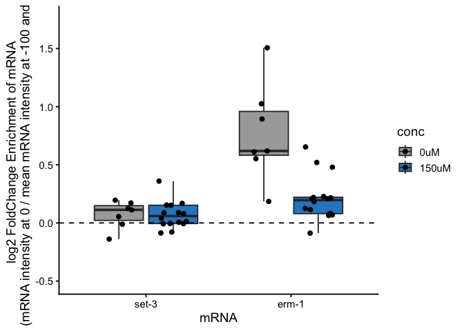
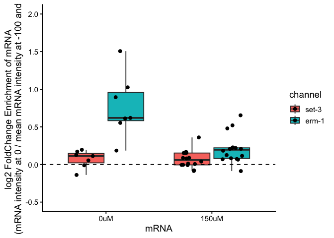

280803_Nocodazole_Treatments
================
Erin Osborne Nishimura
2026-08-03

- [Load the libraries](#load-the-libraries)
- [Import the data that was outputted from
  FIJI](#import-the-data-that-was-outputted-from-fiji)
- [Create annotation columns](#create-annotation-columns)
- [Merge data together and plot
  lineplots](#merge-data-together-and-plot-lineplots)
- [Center the data at the middle and select key
  columns](#center-the-data-at-the-middle-and-select-key-columns)
- [Re-arrange the dataset and normalized by
  embryo-specific-means](#re-arrange-the-dataset-and-normalized-by-embryo-specific-means)
- [Plot individual, embryo-mean-normalized
  lineplots](#plot-individual-embryo-mean-normalized-lineplots)
- [Merge the data to plot the average lineplots of embryo-specific-mean
  normalized
  lineplots](#merge-the-data-to-plot-the-average-lineplots-of-embryo-specific-mean-normalized-lineplots)
  - [Save plots](#save-plots)
- [Try to create a metric of “membrane-y-ness” for each condition
  combo](#try-to-create-a-metric-of-membrane-y-ness-for-each-condition-combo)
  - [Save the plots](#save-the-plots)
- [Export data for supplementary
  tables](#export-data-for-supplementary-tables)
  - [Raw and normalized data](#raw-and-normalized-data)
  - [Merged and averaged data](#merged-and-averaged-data)
  - [Stats](#stats)
  - [Rep- and n-values](#rep--and-n-values)
- [Session info](#session-info)

## Load the libraries

- tidyverse
- data.table
- rstatix

``` r
library(tidyverse)
library(data.table)
library(rstatix)
```

## Import the data that was outputted from FIJI

Note:

channel 1 = set-3

channel 2 = erm-1

Import the quantified smFISH data from the FIJI macro. This script took
image files, created z-projections using the “sum” function, then
calculated the intergrated values of smFISH intensity across an x-y
rectangle in which the intensity was summed in y and output in terms of
x.

This data is from the strain wNT002 that allows us to check that the
Nocodazole was working by reporting the TBB-2::GFP patterning.

``` r
# import the data
control_1 <- read.table(file = "../01_input/2025-03-13_1033_datafile_for_220914_0uM_Noco_wNT002_Rep1.txt", header = FALSE, sep = "\t")
control_2 <- read.table(file = "../01_input/2026-03-13_0121_datafile_for_231112_0uM_Noco_wNT002_Rep2.txt", header = FALSE, sep = "\t")

test_1 <- read.table(file = "../01_input/2026-03-14_0622_datafile_for_220914_150uM_Noco_wNT002_Rep1.txt", header = FALSE, sep = "\t")
test_2 <- read.table(file = "../01_input/2026-03-14_0624_datafile_for_230210_150uM_Noco_wNT002_Rep2.txt", header = FALSE, sep = "\t")
test_3 <- read.table(file = "../01_input/2026-03-14_0928_datafile_for_231112_150uM_Noco_wNT002_Rep3.txt", header = FALSE, sep = "\t")
test_4 <- read.table(file = "../01_input/2026-03-14_0934_datafile_for_231114_150uM_Noco_wNT002_Rep4.txt", header = FALSE, sep = "\t")

# test its dimensions
#dim(control_1)
#dim(control_2)
#dim(test_1)
#dim(test_2)
#dim(test_3)
#dim(test_4)

# Rename the column names
col_times <- paste(rep(1:333), sep = "")
#col_times
colnames(control_1) <- c("file", "channel", col_times)
colnames(control_2) <- c("file", "channel", col_times)
colnames(test_1) <- c("file", "channel", col_times)
colnames(test_2) <- c("file", "channel", col_times)
colnames(test_3) <- c("file", "channel", col_times)
colnames(test_4) <- c("file", "channel", col_times)

# Check that the dimensions remain unchanged
#dim(control_1)
#dim(control_2)
#dim(test_1)
#dim(test_2)
#dim(test_3)
#dim(test_4)

# Example of what this looks like...
control_1[1:7,1:8]
```

    ##                                          file channel         1          2
    ## 1                                        file channel     0.000     0.1072
    ## 2 220914_permed_wNT002_0uM_Noco_09_R3D_D3D.dv     ch2  4927.838  4955.0391
    ## 3 220914_permed_wNT002_0uM_Noco_09_R3D_D3D.dv     ch1  3282.429  3204.0681
    ## 4 220914_permed_wNT002_0uM_Noco_11_R3D_D3D.dv     ch2  6553.232  6475.7100
    ## 5 220914_permed_wNT002_0uM_Noco_11_R3D_D3D.dv     ch1 11180.594 10908.9131
    ## 6 220914_permed_wNT002_0uM_Noco_16_R3D_D3D.dv     ch2  4500.523  4653.0015
    ## 7 220914_permed_wNT002_0uM_Noco_16_R3D_D3D.dv     ch1  6357.355  6320.0615
    ##            3          4          5         6
    ## 1     0.2144     0.3215     0.4287    0.5359
    ## 2  4944.1055  4942.7622  4938.8066 4930.8765
    ## 3  3141.3899  3096.0930  3082.9082 3110.7231
    ## 4  6447.5361  6479.0288  6555.7827 6661.5508
    ## 5 10611.4062 10339.7393 10037.0146 9899.0576
    ## 6  4767.8940  4797.5332  4711.6953 4564.0063
    ## 7  6328.0981  6306.6831  6297.7476 6301.1558

``` r
#control_2[1:9,1:8]
#test_1[1:3,1:8]
#test_2[1:9,1:8]
#test_3[1:9,1:8]
#test_4[1:9,1:8]
```

## Create annotation columns

Add the annotation columns “date”, “strain”, “conc”, and “embryoID”
taken from the identifier

Merge the datasets together

``` r
# Extract out the salient information from the filename and pivot the data longer - "permed" version
control_1_exp <- control_1[2:dim(control_1)[1],] %>%
  separate_wider_delim(file, delim = "_", names = c("date", NA, "strain", "conc", NA, "embryoID", NA, NA)) %>%
  pivot_longer(cols = `1`:`333`, names_to = "xpoint", values_to = "intensity") %>%
  mutate(unique_id = paste(date, strain, conc, embryoID, channel, sep = "_"))

test_1_exp <- test_1[2:dim(test_1)[1],1:335] %>%
  separate_wider_delim(file, delim = "_", names = c("date", NA, "strain", "conc", NA, "embryoID", NA, NA)) %>%
  pivot_longer(cols = `1`:`333`, names_to = "xpoint", values_to = "intensity") %>%
  mutate(unique_id = paste(date, strain, conc, embryoID, channel, sep = "_"))

# Extract out the salient information from the filename and pivot the data longer
control_2_exp <- control_2[2:dim(control_2)[1],1:335] %>%
  separate_wider_delim(file, delim = "_", names = c("date", "strain", "conc", NA, "embryoID", NA, NA)) %>%
  pivot_longer(cols = `1`:`333`, names_to = "xpoint", values_to = "intensity") %>%
  mutate(unique_id = paste(date, strain, conc, embryoID, channel, sep = "_"))

test_2_exp <- test_2[2:dim(test_2)[1],1:335] %>%
  separate_wider_delim(file, delim = "_", names = c("date", "strain", "conc", NA, "embryoID", NA, NA)) %>%
  pivot_longer(cols = `1`:`333`, names_to = "xpoint", values_to = "intensity") %>%
  mutate(unique_id = paste(date, strain, conc, embryoID, channel, sep = "_"))

test_3_exp <- test_3[2:dim(test_3)[1],1:335] %>%
  separate_wider_delim(file, delim = "_", names = c("date", "strain", "conc", NA, "embryoID", NA, NA)) %>%
  pivot_longer(cols = `1`:`333`, names_to = "xpoint", values_to = "intensity") %>%
  mutate(unique_id = paste(date, strain, conc, embryoID, channel, sep = "_"))

test_4_exp <- test_4[2:dim(test_4)[1],1:335] %>%
  separate_wider_delim(file, delim = "_", names = c("date", "strain", "conc", NA, "embryoID", NA, NA)) %>%
  pivot_longer(cols = `1`:`333`, names_to = "xpoint", values_to = "intensity") %>%
  mutate(unique_id = paste(date, strain, conc, embryoID, channel, sep = "_"))


# Add in the timepoints
addInTimepoints <- function(tibble) {
  timepoints <- as.vector(unlist(control_1[1,3:335]))
  repnumb = dim(tibble)[1]/333
  tibble::add_column(tibble, timepoints = rep(timepoints,repnumb), .after = "xpoint")
}

control_1_plustime <- addInTimepoints(control_1_exp)
control_2_plustime <- addInTimepoints(control_2_exp)
test_1_plustime <- addInTimepoints(test_1_exp)
test_2_plustime <- addInTimepoints(test_2_exp)
test_3_plustime <- addInTimepoints(test_3_exp)
test_4_plustime <- addInTimepoints(test_4_exp)

# check it - make sure that there is a break between ch2 and ch1 at timepoint 333
#control_1_plustime[330:340,]
#control_2_plustime[330:340,]
#test_1_plustime[330:340,]
#test_2_plustime[330:340,]
#test_3_plustime[330:340,]
#test_4_plustime[330:340,]
```

## Merge data together and plot lineplots

Merge data

Plot the individual lineplots. This gives us a sense of the variance
across samples.

``` r
# Merge the datasets together 
nocodazole_data_total <- rbind(control_1_plustime, control_2_plustime, test_1_plustime, test_2_plustime, test_3_plustime, test_4_plustime)

# Plot it - all samples
ggplot(data = nocodazole_data_total, aes(x = timepoints, y = intensity, group = c(unique_id))) +
  geom_line(aes(colour = unique_id))+
  facet_wrap(~ channel + conc)+
  guides(color = "none")+
  theme_bw()
```

<!-- -->

## Center the data at the middle and select key columns

This helps us set x = 0 in the middle

``` r
# conversions 
noco_dt <- as.data.table(nocodazole_data_total)
noco_dt$xpoint <- as.integer(noco_dt$xpoint)

# Fixed coordinate: recenter xpoint (1:333) to run -166:166, identical for
# every embryo and every channel - no peak-finding, no per-embryo offset.
noco_dt[, aligned_row := xpoint - 167]

# Check that everything worked
#dim(nocodazole_data_total)
#dim(noco_dt) #Should be one column longer than above
#range(noco_dt$aligned_row)

# Rename to match the variable name the rest of the script expects
total_align_long <- noco_dt %>%
  select(strain, aligned_row, unique_id, intensity)
```

## Re-arrange the dataset and normalized by embryo-specific-means

``` r
# Normalize the data by dividing by the embryo-specific mean
nocodazole_norm_total <- total_align_long %>%
  separate_wider_delim(unique_id, delim = "_", names = c("date", NA, "conc", "embryoID", "channel")) %>%
  group_by(date, embryoID, channel, conc) %>%
  mutate(normalized_intensity = intensity / mean(intensity, na.rm = TRUE))

table(nocodazole_norm_total$channel, nocodazole_norm_total$conc)
```

    ##      
    ##        0uM 150uM
    ##   ch1 2331  5328
    ##   ch2 2331  5328

``` r
head(nocodazole_norm_total)
```

    ## # A tibble: 6 × 8
    ## # Groups:   date, embryoID, channel, conc [1]
    ##   strain aligned_row date  conc  embryoID channel intensity normalized_intensity
    ##   <chr>        <dbl> <chr> <chr> <chr>    <chr>       <dbl>                <dbl>
    ## 1 wNT002        -166 2209… 0uM   09       ch2         4928.                0.873
    ## 2 wNT002        -165 2209… 0uM   09       ch2         4955.                0.878
    ## 3 wNT002        -164 2209… 0uM   09       ch2         4944.                0.876
    ## 4 wNT002        -163 2209… 0uM   09       ch2         4943.                0.876
    ## 5 wNT002        -162 2209… 0uM   09       ch2         4939.                0.875
    ## 6 wNT002        -161 2209… 0uM   09       ch2         4931.                0.874

``` r
# Note - this would be a good object to save as a supplementary table
```

## Plot individual, embryo-mean-normalized lineplots

``` r
normalized_linescan <- ggplot(data = nocodazole_norm_total, aes(x = aligned_row, y = normalized_intensity, 
                                     group = interaction(date, embryoID, channel))) +
  geom_line(aes(color = interaction(date, embryoID, channel)), alpha = 0.5) +
  facet_wrap(~ channel + conc) +
  guides(color = "none") +
  theme_bw()

normalized_linescan
```

<!-- -->

## Merge the data to plot the average lineplots of embryo-specific-mean normalized lineplots

``` r
# Separate out the unique identifier info, then pivot wider
noco_wide_by_sample <- nocodazole_norm_total %>%
  pivot_wider(names_from = c(date, embryoID), 
            values_from = normalized_intensity,
            id_cols = c(strain, aligned_row, conc, channel))

# colnames(noco_wide_by_sample)
# str(noco_wide_by_sample)
# head(noco_wide_by_sample)

# Play around with mean, medium, and sum:
noco_wide_with_stats <- noco_wide_by_sample %>%
  rowwise() %>%
  mutate(sum_signal = sum(c_across(`220914_09`:`231114_03`), na.rm = TRUE)) %>%
  mutate(mean_signal = mean(c_across(`220914_09`:`231114_03`), na.rm = TRUE)) %>%
  mutate(median_signal = median(c_across(`220914_09`:`231114_03`), na.rm = TRUE)) %>%
  mutate(sd_signal = sd(c_across(`220914_09`:`231114_03`), na.rm = TRUE))

# str(noco_wide_with_stats)
# colnames(noco_wide_with_stats)
# noco_wide_with_stats

noco_wide_with_range <- noco_wide_with_stats %>%
  rowwise() %>%
  mutate(ymeanmax = sum(mean_signal, sd_signal) ) %>%
  mutate(ymeanmin = sum(mean_signal, -sd_signal)) 

# select colors
colorselection = c("#000000", "#ee2b7b")

# Plot split by Nocodazole concentration
a <- ggplot(data = noco_wide_with_range, aes(x = aligned_row, y = mean_signal, group = interaction(channel, conc)))+
  geom_line(aes(color=channel))+
  scale_color_manual(values = colorselection, aesthetics = c("colour", "fill"), labels = c("set-1 mRNA", "erm-1 mRNA"))+
  geom_ribbon(aes(ymin = ymeanmin, ymax = ymeanmax, fill=channel), alpha = 0.2, ) +
  facet_wrap(~ conc)+
  theme_bw()

a
```

<!-- -->

``` r
# Plot in a different way - set-3 and erm-1 mRNA split into facets
colorselection = c("#2189ce", "#000000")
channel.labs <- c("set-3 mRNA", "erm-1 mRNA")
names(channel.labs) <- c("ch1", "ch2")

# Plot split by transcript
b <- ggplot(data = noco_wide_with_range, aes(x = aligned_row, y = mean_signal, group = interaction(channel, conc)))+
  geom_line(aes(color=conc))+
  scale_color_manual(values = colorselection, aesthetics = c("colour", "fill"), labels = c("0 uM Nocodazole", "150 uM Nocodazole"))+
  geom_ribbon(aes(ymin = ymeanmin, ymax = ymeanmax, fill=conc), alpha = 0.2, ) +
  facet_wrap(~ channel, labeller = labeller(channel = channel.labs))+
  theme_bw()

b
```

<!-- -->

### Save plots

Use the \_byconc version for the figure.

``` r
today <- format(Sys.Date(), "%y%m%d")
filename <- paste("../03_outputPlots/", today, "_erm_set3_nocodazole_byconc.pdf", sep = "")
pdf(file = filename, width = 4, height = 3)
a
dev.off()
```

    ## quartz_off_screen 
    ##                 2

``` r
today <- format(Sys.Date(), "%y%m%d")
filename <- paste("../03_outputPlots/", today, "_erm_set3_nocodazole_bytranscript.pdf", sep = "")
pdf(file = filename, width = 4, height = 3)
b
dev.off()
```

    ## quartz_off_screen 
    ##                 2

## Try to create a metric of “membrane-y-ness” for each condition combo

I want a metric that reports the ratio of erm-1 intensity signal at “0”
(the peak) versus at -100 or +100. I’ll take the average of -100 and
+100.

``` r
# extract the "peak" at 1 versus the -100 and +100 values
peaks_and_valleys <- nocodazole_norm_total %>%
  filter(aligned_row %in% c(-100, 1, 100))

# Nest the -100, 1, and +100 values into a single cell 
nest_pandv <- peaks_and_valleys %>%
  group_by(date, conc, embryoID, channel) %>%
  nest()

# A function to calculate the ratio of the value at 1 compared to the mean of -100 and +100 - Sam's version
my_calc2 <- function(df) {
  df$normalized_intensity[2] /
    mean(c(df$normalized_intensity[1], df$normalized_intensity[3]))
}

# Calculate the ratio for each datapoint
foldChange_calc <- nest_pandv %>%
  mutate(fc_enrich = map_dbl(data, my_calc2))

# Change some columns to factors
foldChange_calc$conc <- as.factor(foldChange_calc$conc)
foldChange_calc$channel <- as.factor(foldChange_calc$channel)

# calculate the max & min - figure out how to set the y-axis
summary(log(foldChange_calc$fc_enrich, base = 2))
```

    ##     Min.  1st Qu.   Median     Mean  3rd Qu.     Max. 
    ## -0.13913  0.05686  0.13908  0.22562  0.21840  1.50658

``` r
# plot the data - I picked two different ways to display the data
# For the figure, we selected "e"

d <- ggplot(data = foldChange_calc, aes(x = as.factor(channel), y = log(fc_enrich, base = 2), fill = conc))+
  geom_boxplot(outlier.shape = NA)+
  geom_jitter(position=position_jitterdodge())+
  scale_y_continuous(limits = c(-0.5, 1.75)) +
  geom_hline(yintercept = 0, linetype = "dashed") +
  scale_fill_manual(values = c("0uM" = "darkgray", "150uM" = "#2989ca"))+
  labs(y = "log2 FoldChange Enrichment of mRNA \n(mRNA intensity at 0 / mean mRNA intensity at -100 and 100)", x = "mRNA") +
  scale_x_discrete(labels = c("ch1" = "set-3", "ch2" = "erm-1"))+
  theme_classic(base_size = 14)

d
```

<!-- -->

``` r
e <- ggplot(data = foldChange_calc, aes(x = as.factor(conc), y = log(fc_enrich, base = 2), fill = channel))+
  geom_boxplot(outlier.shape = NA)+
  geom_jitter(position=position_jitterdodge())+
  scale_y_continuous(limits = c(-0.5, 2)) +
  geom_hline(yintercept = 0, linetype = "dashed") +
  labs(y = "log2 FoldChange Enrichment of mRNA \n(mRNA intensity at 0 / mean mRNA intensity at -100 and 100)", x = "mRNA") +
  scale_fill_discrete(labels = c("set-3", "erm-1")) +
  theme_classic(base_size = 14)

e
```

<!-- -->
\### Calculate the statistics

``` r
# foldChange_calc

stats_wilcox <- foldChange_calc %>%
  group_by(channel) %>%
  wilcox_test(fc_enrich ~ conc) %>%
  adjust_pvalue(method = "BH") %>%
  add_significance()

stats_wilcox
```

    ## # A tibble: 2 × 10
    ##   channel .y.   group1 group2    n1    n2 statistic       p   p.adj p.adj.signif
    ##   <fct>   <chr> <chr>  <chr>  <int> <int>     <dbl>   <dbl>   <dbl> <chr>       
    ## 1 ch1     fc_e… 0uM    150uM      7    16        62 0.720   0.720   ns          
    ## 2 ch2     fc_e… 0uM    150uM      7    16       101 0.00148 0.00295 **

### Save the plots

Used v1 in the figure.

``` r
# set plotnames and save the plots
today <- format(Sys.Date(), "%y%m%d")
filename <- paste("../03_outputPlots/", today, "_set3_erm1_boxplot_nocodazole_v1.pdf", sep = "")
pdf(filename, width = 6, height = 6)
d
dev.off()
```

    ## quartz_off_screen 
    ##                 2

``` r
filename <- paste("../03_outputPlots/", today, "_set3_erm1_boxplot_nocodazole_v2.pdf", sep = "")
pdf(filename, width = 6, height = 6)
e
dev.off()
```

    ## quartz_off_screen 
    ##                 2

``` r
getwd()
```

    ## [1] "/Users/erin/Library/CloudStorage/Dropbox/github/ERM1_TorresMangual/01_nocodazole_treatments/intensity_scan_analysis/02_R_analysis/02_scripts"

## Export data for supplementary tables

### Raw and normalized data

``` r
### RAW AND NORMALIZED DATA 

#colnames(nocodazole_norm_total)
#head(nocodazole_norm_total)

# Reorganize the column order for clarity
noco_supp_data1 <- nocodazole_norm_total %>%
  select(strain, conc, date, embryoID, channel, aligned_row, intensity, normalized_intensity)
head(noco_supp_data1)
```

    ## # A tibble: 6 × 8
    ## # Groups:   date, embryoID, channel, conc [1]
    ##   strain conc  date  embryoID channel aligned_row intensity normalized_intensity
    ##   <chr>  <chr> <chr> <chr>    <chr>         <dbl>     <dbl>                <dbl>
    ## 1 wNT002 0uM   2209… 09       ch2            -166     4928.                0.873
    ## 2 wNT002 0uM   2209… 09       ch2            -165     4955.                0.878
    ## 3 wNT002 0uM   2209… 09       ch2            -164     4944.                0.876
    ## 4 wNT002 0uM   2209… 09       ch2            -163     4943.                0.876
    ## 5 wNT002 0uM   2209… 09       ch2            -162     4939.                0.875
    ## 6 wNT002 0uM   2209… 09       ch2            -161     4931.                0.874

``` r
# Save the raw and normalized data:
today <- format(Sys.Date(), "%y%m%d")
filename <- paste("../04_outputData/", today, "_data1_noco_raw_and_norm_linescan.txt", sep = "")
write.table(nocodazole_norm_total, file = filename, sep = "\t", quote = FALSE, row.names = FALSE)
```

### Merged and averaged data

``` r
## MERGED DATA

# Use this one for stats. Need to remove the time/date specific data
#head(noco_wide_with_range)
#colnames(noco_wide_with_range)

# Reorganize the data:
noco_supp_data2 <- noco_wide_with_range %>%
  select(strain, conc, channel, aligned_row, sum_signal, mean_signal, median_signal, sd_signal, ymeanmax, ymeanmin)

# Save the raw and normalized data:
today <- format(Sys.Date(), "%y%m%d")
filename <- paste("../04_outputData/", today, "_data2_noco_merged_normed_linescan.txt", sep = "")
write.table(noco_supp_data2, file = filename, sep = "\t", quote = FALSE, row.names = FALSE)
```

### Stats

``` r
## STATISTICS

# head(stats_wilcox)

# Save the stats:
today <- format(Sys.Date(), "%y%m%d")
filename <- paste("../04_outputData/", today, "_data3_noco_stats_linescan.txt", sep = "")
write.table(stats_wilcox, file = filename, sep = "\t", quote = FALSE, row.names = FALSE)
```

### Rep- and n-values

``` r
## N-and-rep-values

# select the metadata
noco_metadata <- nocodazole_norm_total %>% 
  select("strain", "date", "conc", "embryoID", "channel")

#str(noco_metadata)
# head(noco_metadata)

# tabulate the number of n-values. Divide by 2 because both set-3 and erm-1 are both counted as a data point
rep_and_n1 <- table(noco_metadata$conc, noco_metadata$date)/2

# Save the rep- and n-values:
today <- format(Sys.Date(), "%y%m%d")
filename <- paste("../04_outputData/", today, "_data4_noco_n_linescan.txt", sep = "")
write.table(rep_and_n1, file = filename, sep = "\t", quote = FALSE, row.names = TRUE)
```

## Session info

``` r
sessionInfo()
```

    ## R version 4.6.0 (2026-04-24)
    ## Platform: aarch64-apple-darwin23
    ## Running under: macOS Tahoe 26.5.2
    ## 
    ## Matrix products: default
    ## BLAS:   /Library/Frameworks/R.framework/Versions/4.6/Resources/lib/libRblas.0.dylib 
    ## LAPACK: /Library/Frameworks/R.framework/Versions/4.6/Resources/lib/libRlapack.dylib;  LAPACK version 3.12.1
    ## 
    ## locale:
    ## [1] en_US.UTF-8/en_US.UTF-8/en_US.UTF-8/C/en_US.UTF-8/en_US.UTF-8
    ## 
    ## time zone: America/Denver
    ## tzcode source: internal
    ## 
    ## attached base packages:
    ## [1] stats     graphics  grDevices utils     datasets  methods   base     
    ## 
    ## other attached packages:
    ##  [1] rstatix_1.1.0     data.table_1.18.4 lubridate_1.9.5   forcats_1.0.1    
    ##  [5] stringr_1.6.0     dplyr_1.2.1       purrr_1.2.2       readr_2.2.0      
    ##  [9] tidyr_1.3.2       tibble_3.3.1      ggplot2_4.0.3     tidyverse_2.0.0  
    ## 
    ## loaded via a namespace (and not attached):
    ##  [1] utf8_1.2.6         generics_0.1.4     stringi_1.8.7      hms_1.1.4         
    ##  [5] digest_0.6.39      magrittr_2.0.5     evaluate_1.0.5     grid_4.6.0        
    ##  [9] timechange_0.4.0   RColorBrewer_1.1-3 fastmap_1.2.0      backports_1.5.1   
    ## [13] Formula_1.2-6      scales_1.4.0       abind_1.4-8        cli_3.6.6         
    ## [17] rlang_1.3.0        withr_3.0.3        yaml_2.3.12        otel_0.2.0        
    ## [21] tools_4.6.0        tzdb_0.5.0         broom_1.0.13       vctrs_0.7.3       
    ## [25] R6_2.6.1           lifecycle_1.0.5    car_3.1-5          pkgconfig_2.0.3   
    ## [29] pillar_1.11.1      gtable_0.3.6       glue_1.8.1         xfun_0.60         
    ## [33] tidyselect_1.2.1   rstudioapi_0.19.0  knitr_1.51         farver_2.1.2      
    ## [37] htmltools_0.5.9    rmarkdown_2.31     carData_3.0-6      labeling_0.4.3    
    ## [41] compiler_4.6.0     S7_0.2.2
